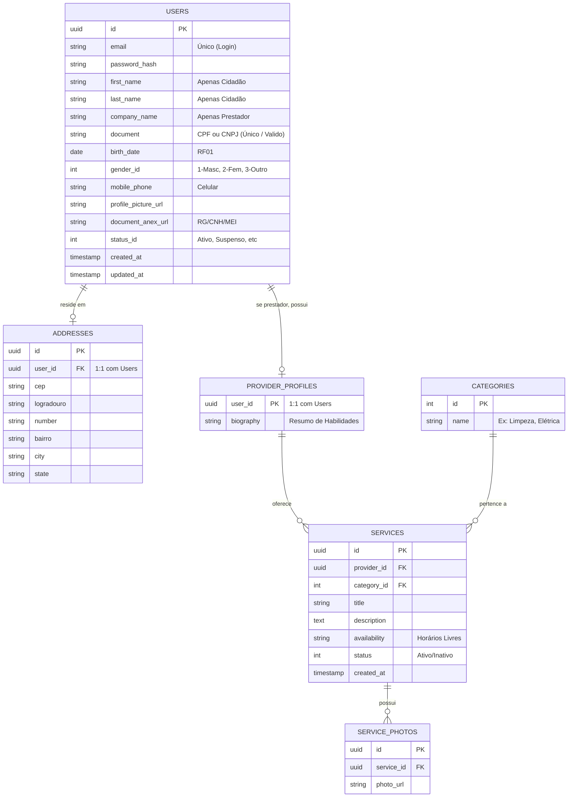

# Modelo Entidade-Relacionamento (MER)

Este diagrama representa a estrutura necessária para englobar os casos **RF01 (Cliente)**, **RF02 (Prestador)** e **RF03 (Serviço)**. Como ambos Clientes e Prestadores acessam o sistema com "E-mail e Senha" e possuem formato de endereço virtualmente idênticos, utilizaremos uma base única e especializaremos suas funções através de perfis.

### Diagrama MER Completo

## Tratamento Base de Usuários
Esta tabela centralizada de `USERS` utiliza o conceito de *Single Table Strategy* para dados comuns, e tabelas associadas 1:1 (`ADDRESSES` e `PROVIDER_PROFILES`) para dados ramificados, mantendo uma rastreabilidade de histórico (Status) em todos os casos de acordo com os Requisitos Funcionais.
