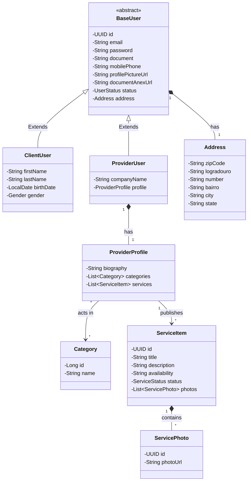

# Mapeamento de Classes (Visão de Domínio Base)

O ecossistema Java (Spring Boot) refletirá a persistência através da JPA (`@MappedSuperclass` ou `@Inheritance`). O design abaixo ilustra os Aggregates de Domínio para a plataforma.

## Diagrama UML das Principais Classes do Domínio

## Estrutura de Domínios (Domain-Driven Design)

No back-end isolaremos os pacotes para diminuir complexidades de herança:
* `br.com.comunidade.identity.*`
* `br.com.comunidade.catalog.*`

Usar enums como `Gender(MALE, FEMALE, OTHER)` e `UserStatus(PENDING, ACTIVE, SUSPENDED)` para manter fidelidade com as flags requeridas nos RF01/RF02/RF03.
