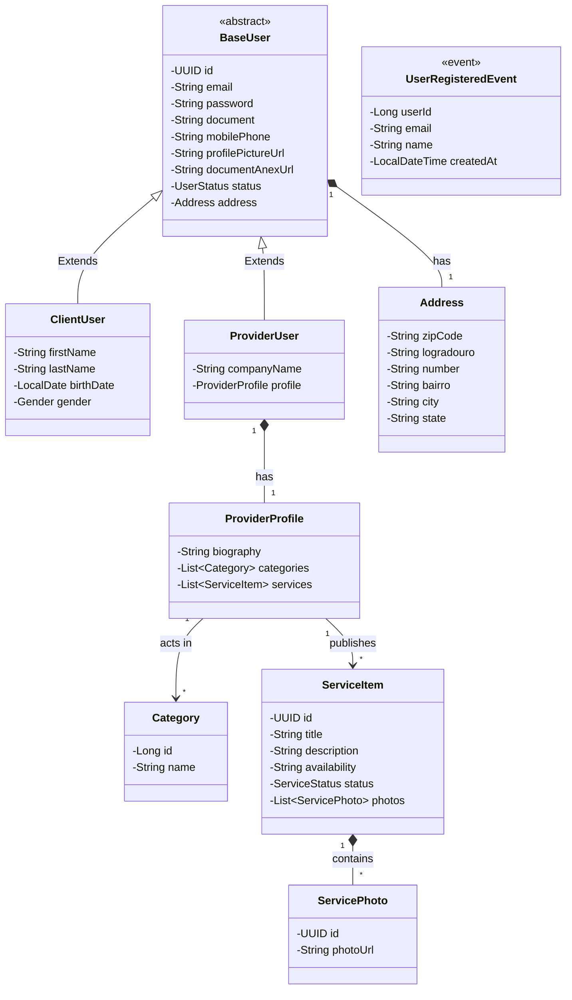

# Mapeamento de Classes (Visão de Domínio Base)

O ecossistema Java (Spring Boot) refletirá a persistência através da JPA (`@MappedSuperclass` ou `@Inheritance`). O design abaixo ilustra os Aggregates de Domínio para a plataforma.

## Diagrama UML das Principais Classes do Domínio

## Estrutura de Domínios (Domain-Driven Design)

No back-end isolaremos os pacotes para diminuir complexidades de herança e facilitar o isolamento por microserviços:
* `com.comunidade.identity.*` (Gerenciamento de usuários e perfis)
* `com.comunidade.catalog.*` (Catálogo de serviços e vitrine)
* `com.comunidade.notification.*` (Consumo de eventos e disparos de e-mail)

Usar enums como `Gender(MALE, FEMALE, OTHER)`, `UserStatus(PENDING, ACTIVE, SUSPENDED)` e `ServiceStatus(ACTIVE, INACTIVE, SUSPENDED)` para manter fidelidade com as regras de negócio.
